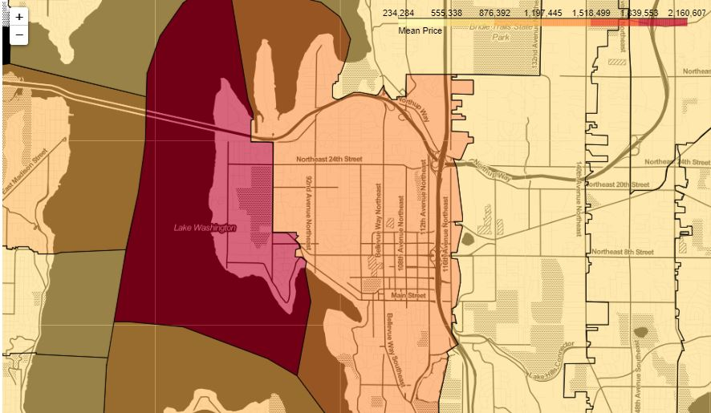

# House Sales Prediction

## Problem
In recent years, investment in property has been enjoyed by many people. This causes the demand for property in the King County area to be higher than the number of existing properties. By taking advantage of this prospect, overseas-based property developer A wants to expand its business area in King County, USA. However, property developer A does not know the market price of the house and what variables affect the price of the house. Prediction of house price fixing is needed so that property developer A can compete with other property developers.

## Goals
Build a model to predict house price fixing in the King County area by property developer A.

## Consclusion
- Most of the sale house are sold have 3 - 5 bedrooms
- Most of the sale houses have a bathroom type 2.5, namely 2 full bathrooms and 1 toilet with a sink
- Having a large number of bedrooms does not mean that the house price will be more expensive
- Having a large number of bathrooms does not mean that the house price is getting more expensive
- The wider the house, the more expensive it will be

- From the map of King County above, the area that has the highest average price is around Lake Washington, followed by the surrounding areas. Areas far from Lake Washington have prices that are quite low

